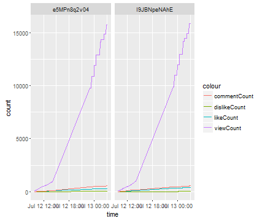

Task scheduler and Crontab with R
========================================================
author: Aritra Biswas 
date: 07/19/2016
autosize: true

Task scheduler and Crontab with R
========================================================

From the point of view of a data scientist this is important to explore a phenomena over time. While conducting an experiment with social networking sites websites I've found these beautiful tools which can run r scripts automatically after a per specified time by the user. Here is a tutorial explaining task scheduling process for Windows 10 and Linux Debian Jessie (This is the latest OS for Raspberry Pi).

Here we will observe two videos from the Times Now YouTube channel and try to understand the change in viewership and other related statistics over time. For this process, we will use the YouTube data API and R. We will download the data from the YouTube data API after a certain time interval and store them in an R friendly Object. 

========================================================

After running this process for several hours we will try to understand the data pattern using statistical models. Here for demonstration purpose initially we will visualize the data using ggplot2. We also will try to predict the view count or any other variable using them as dependent variable.

__Note:__ This is only for demonstration purpose. This model will not fit well in this case, since the data is not linear in nature. Other higher degree polynomials Of the dependent variable or any black box predictors can be taken under consideration for accuracy.

This process can be used with many more such application where running a script is essential after a interval of time. 

For windows:
========================================================

To demonstrate this process we need a small R script which will be executed after specific time (i.e. every 5 minutes) on windows using the default application Task scheduler. For demonstration purpose we are considering this code:


```r
time<-Sys.time();
df<-data.frame(time);
names(df)<-"SYSTEM_TIME";
write.csv(df,"systemtime.csv");
head(df)
```

Let us save the above code a file called systime.R. Note down the path of the folder which contains this file. In my case this case the file is saved the file in __`C:\Users\Aritra\Desktop`__.

Open task scheduler:
========================================================
Now go to __Control Panel-> Administrative Tools -> Task Scheduler__.

Select Create Basic Task, provide a name and a description of the task so that this can be easily recognized later. Click on next.


Create a one time task:
========================================================
Select __One time__ and click on next. This will create a one time job initially. Later on we will change the task so that it will be executed after a specified time. The time lag on which the script will be executed (i.e.once a day, week or month) will be specified later. 


Select date and time:
========================================================
__Select the date and time__ when the task will be executed for the first time. This is recommended to set the time a few minutes ahead from current time. 


Start a basic task:
========================================================
Under Action choose __Start a program, click on next__.  


Create a .bat file:
========================================================
Now, a .bat file has to be created. It will be executed from command prompt in windows. The analog of this .bat file in Linux is .sh. Write the following lines of code in a notepad file: 

__`@echo off`__

__`R CMD BATCH C:\Users\Aritra\systime.R`__

Save this file as a .bat file. Here it is saved as systime.bat. To check whether this .bat file is working properly or not, one may simply click on the .bat file. This should execute the R script from command prompt and generate a .csv and a .Rout file. The.csv file should contain the system time of execution of the R script and .Rout file should contain all the text printed out in R terminal. This may be useful to diagnose error if there is any. 

Save .bat file:
========================================================
Here the path __`"C:\Users\Aritra\systime.R"`__ is the location of my script, this path must be change with the file location of your r script.  


Select task in task scheduler:
========================================================

In task scheduler, __Browse the .bat file__ in the field of Program Script. Click Next.


Create basic task:
========================================================

__Check in Open the Properties dialog__. Click on Finish.  


Grant administrator privileges:
========================================================
Under General tab, __check in Run with highest priviliges__.  

Using sudo (in Linux) or running with highest privilege (in windows) is important in this case because it will allow r script to write data. If highest privilege is not grander saving the data file may be disrupted. 


Edit task setting:
========================================================
__Change and shift to Triggers tab. Select task and click on edit.__  


Edit trigger:
========================================================
Check in Repeat task every and select duration. When you click on a time lag then you can simply change the value from keyboard. This will enable to execute task at and given time. Further options such as Expire can be edited if required. If not, simply click on OK.   


Layout of .csv file:
========================================================
This .csv file will be generated in the directory of r script.


Layout of .Rout file:
========================================================
This .Rout file will be generated in the same directory. This will contain all the text printed in the R terminal. 


For Linux:
========================================================
Now here we will create the same thing in a Linux environment on raspberry pi. The OS in this device is Debian Jessie. In order to run R script in this device we need to create a .sh file which will contain the bash or terminal script to run R script.  At first create the systime.R file as mentioned earlier. 


```r
time<-Sys.time();
df<-data.frame(time);
names(df)<-"SYSTEM_TIME";
write.csv(df,"systemtime.csv");
head(df)
```

```
          SYSTEM_TIME
1 2016-07-19 18:10:12
```

Creating a shell executable script:
========================================================
Now save this file to into a location. Note down the path. This will be required later. I've save my file on Desktop. Now open terminal, change directory using cd. In my case,

__`cd Desktop`__

Now, open a text editor.  I'm going to use  Leaf pad, which comes pre-installed with raspbian. Type the following line of codes:

__`#! /bin/bash`__

__`R CMD BATCH /home/pi/Desktop/systime.R`__


and save this file as systime.sh.

Changing permission:
========================================================
Now, make the .sh file executable by executing the following command from terminal

__`sudo chmod +x systime.sh`__

or simple right click on the script and go to __Properties -> Permissions -> Allow executing file as program__.

To verify the script is running simply click on the .sh file. The script should be executed and the .csv and .Rout file should be generated.

Using crontab:
========================================================
As task scheduler in windows, Linux has its own version of called crontab. To run it use the following command in terminal:

__`sudo crontab -e`__

If crontab is running for the first time, choose nano to edit the file. Add the following lines of code at the end of the file. # at the beginning of a line means that the line is commented out. Those lines will not be executed. Do not put # in front of the line.

__`* * * * * /home/pi/Desktop/systime.sh`__

 

Using crontab:
========================================================
This line will direct the operating system to run the .sh file after every one minute. There is a option to change this duration. To see how to change this time duration in crontab simply read the commented out lines printed in the terminal.

After the required changes save it using Ctrl+X. Choose Yes, to save changes. 

Now the R script should run from terminal and the latest run time of the script should be saved in a .csv file and as well as in the .Rout file in the selected directory. 

Application in industry:
========================================================

Here I've used `get_video_data()` from the YouTubeR package to track the change in video statistics. What the function does is it downloads the data related to a video in a give period of time. Here I'm tracking videos posted in Times Now's News hour debate on 12nd July. Here I've successfully obtained the change in  viewCount, likeCount, dislikeCount and commentCount for two videos posted in the channel on above mentioned date in 5 mins interval from 10 A.M..

A glimpse at the data:
========================================================
Here what the data looks like:

```
# A tibble: 4 x 8
     items.id
       <fctr>
1 e5MPn8q2v04
2 I9JBNpeNAhE
3 e5MPn8q2v04
4 I9JBNpeNAhE
# ... with 7 more variables: items.snippet.title <chr>,
#   items.snippet.channelTitle <chr>, items.statistics.viewCount <chr>,
#   items.statistics.likeCount <chr>, items.statistics.dislikeCount <chr>,
#   items.statistics.commentCount <chr>, time <time>
```
Visualization:
========================================================
The x-axis and y-axis represents time and count respectively. It shows change in count over time. (Note: My computer was turned off during 2 P.M.-11 P.M. on that day,due to this there is jump in the graph at the same time this can be considered as a reminder that in order to obtain data continuously.)



Fitting a linear model:
========================================================
Here, we are fitting a LM on viewCount w.r.t time. __Time=Current time-Published.At__ . Model does not fits the data well because of non-linearity, but it definitely shows the way forward. 


It's just the beginning
========================================================
There are so many things can be done with this. This is hard to list them. Soon I'm going to share some of the applications based on this. 

<center></center>

Note:
========================================================
__One must turn on a computer for a cetain period of time__. It is true for internet connectivity as well depending on the requirement of the program.  

This is just a simple example of where crontab can be used. There are many more things can be done using crontab, shiny and R. I'm going to present some examples related this topic and shiny soon.

